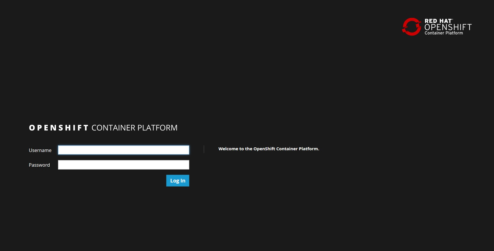

# Workshop: SQL Server 2019 on OpenShift (CTP 2.5)

#### <i>A Microsoft workshop from the SQL Server team</i>

 <h2>Prerequisites</h2>

You'll cover the following topics in this Module:

<dl>

  <dt><a href="#3-0">0.0 Prerequisites</a></dt>
  
</dl>

<h2><a name="3-0">0.0 Prerequisites</a></h2>

In this module you will learn the prerequisites for this workshop.

The workshop does not assume a deep working knowledge of SQL Server or OpenShift. You should know how to use a Linux bash shell. All commands are provided to run the activities.

In order to go through the activities of this workshop you will need the following:

- Access to an OpenShift 3.11 cluster. The workshop is currently designed for OpenShift 3.11 and has not been tested for OpenShift 4.0
- Modules 1 through 4 require user privileges for the OpenShift cluster for **anyuid** at minimum. Module 5 currently requires cluster admin rights.
- A client computer that has access to connect to the OpenShift cluster with the following software installed and configured:
  - A Linux bash shell
  - The OpenShift CLI (oc.exe)
  - Azure Data Studio (Minimum version is 1.5.2). Install from https://docs.microsoft.com/en-us/sql/azure-data-studio/download
  - SQL Command Line Tools (sqlcmd). Check the **For Further Study** section for links to install these tools.
  - git client (only needed if you do not have the latest version of the workshop provided to you by the instructor)
  - In addition, the client computer must be able to connect to the Internet to download a sample file or your instructor must provide it for you (WideWorldImporters-Full.bak)

The workshop currently supports a single node OpenShift cluster but can be run on a multiple cluster environment. Each user will need ~8Gb of RAM to run the containers in the workshop.

**Note**: *If you are attending this course in-person, the instructor may provide you with a client environment and full access to an OpenShift cluster including login credentials.*

With the above environment configured, you can now proceed to the first Acitivity for the course.

<b><a name="aks">Activity: Set up Workshop</a></b>

 

Download the latest version of the workshop from [https://aka.ms/sqlworkshops](https://aka.ms/sqlworkshops)

Navigate to your home directory `~` and enter the following command:

`git clone https://github.com/Microsoft/sqlworkshops.git`

**NOTE**: *If you have used `git clone` to pull down the repo of the workshops in the past, run `git pull` in the sqlworkshops directory to get the latest version.*

Login to your OpenShift cluster by using the URL provided to you for the <b>openshiftConsoleUrl</b> in a web browser.

**NOTE**: *You may get warnings from the web page saying "This site is not secure". Click Details and then "Go on to the webpage"*

You will be presented with a login screen:

Type in the user name and password provided to you for OpenShift cluster access

Note: In-class, your instructor may call this **openshiftAdminUsername** and **openshiftPassword**

You will now see a new web page:

Get the Login command

In the upper right hand corner, click on your user name and select `Copy Login Command` 

Your clipboard now holds a complete `oc login` syntax with a security token. 

Use the token

Open up a shell and paste in the token you copied using the right-click of your mouse or `SHIFT-INSERT`. The command should look similar to the following:

`oc login https://[masterconsoleaddress]:443 --token=[tokenstring]`

Press the `Enter` key

You should see results similar to the following. You are then placed back at the command prompt:

<pre>Logged into "https://[masterconsoleurl]:443" as "ocpadmin" using the token provided.

You have access to the following projects and can switch between them with 'oc project projectname':

  * default
    kube-public
    kube-service-catalog
    kube-system
    management-infra
    openshift
    openshift-ansible-service-broker
    openshift-console
    openshift-infra
    openshift-logging
    openshift-monitoring
    openshift-node
    openshift-sdn
    openshift-template-service-broker
    openshift-web-console

Using project "default".
</pre>

You have now successfully logged into the OpenShift Cluster and can proceed with **Next Steps** below.

<b>For Further Study</b>

- [Red Hat OpenShift](https://www.openshift.com/)
- [oc CLI downloads](https://www.okd.io/download.html)
- [Azure Data Studio](https://docs.microsoft.com/en-us/sql/azure-data-studio/what-is)
- [SQL Command Line Tools for Linux](https://docs.microsoft.com/en-us/sql/linux/sql-server-linux-setup-tools)
- [SQL Command Line Tools for MacOS](https://docs.microsoft.com/en-us/sql/linux/sql-server-linux-setup-tools?view=sql-server-2017#macos)
- [SQL Command Line Tools for Windows](https://www.microsoft.com/en-us/download/details.aspx?id=53591)

<b >Next Steps</b>

Next, Continue to <a href="01_Deploy.md" target="_blank"><i>
Deploy SQL Server on OpenShift</i></a>.
