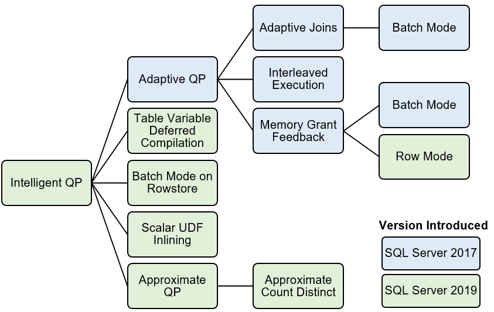
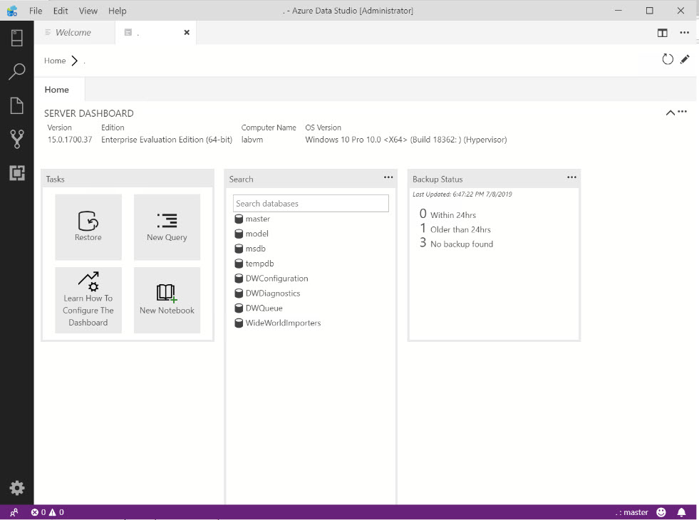
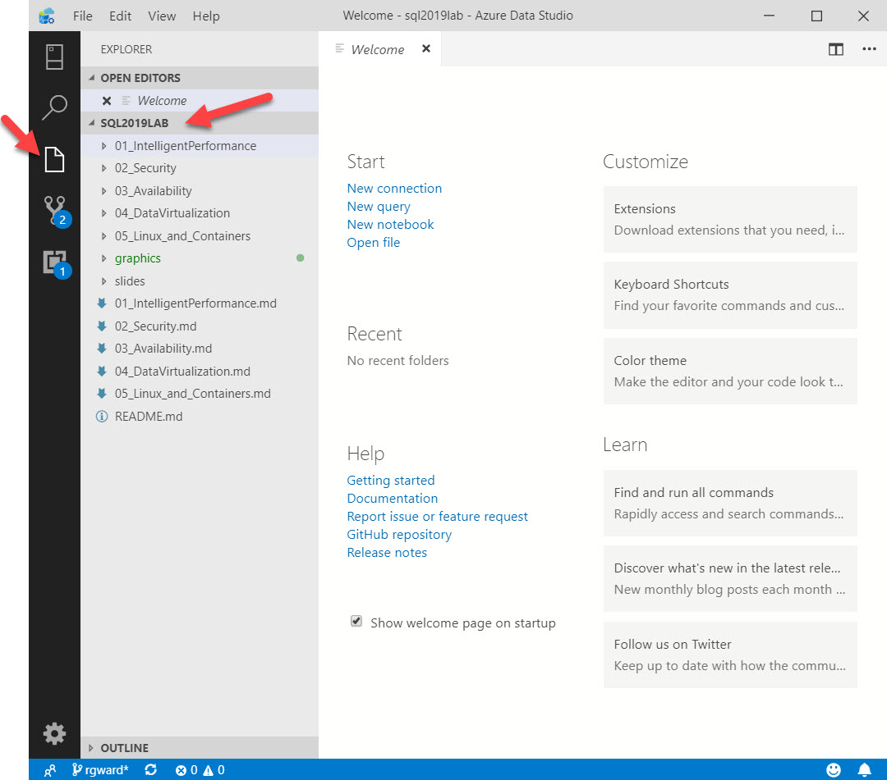
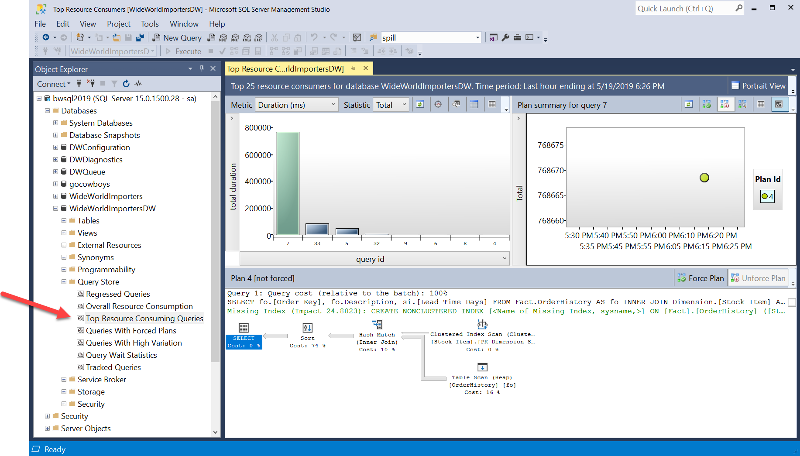
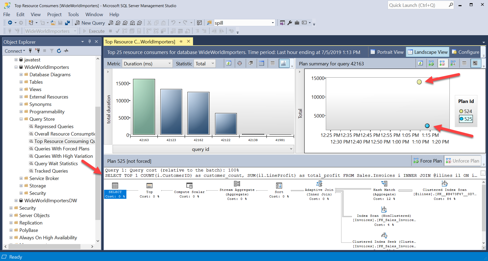
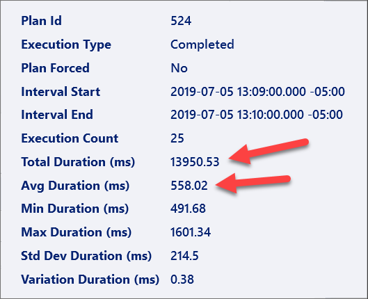
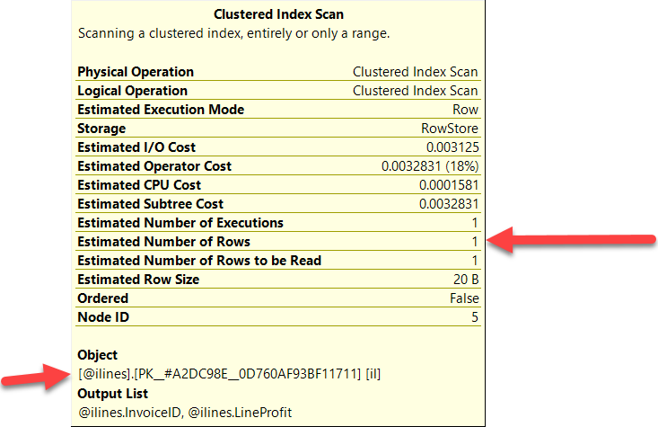
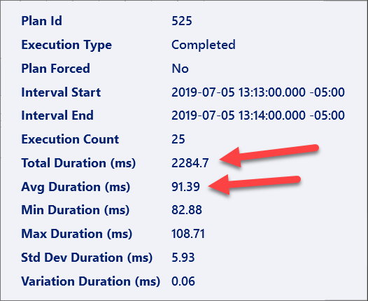
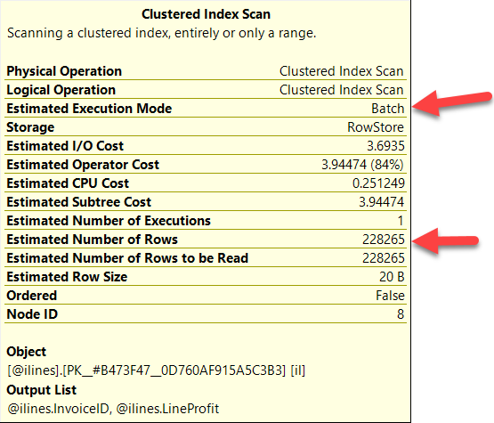

# Workshop: SQL Server 2019 Lab (RC)

#### <i>A Microsoft workshop from the SQL Server team</i>

<h2><b>     SQL Server Intelligent Performance</b></h2>

SQL Server 2019 includes new capabilities designed to enhance your performance with no application changes. These enhancements include:

- Intelligent Query Processing
- Lightweight Query Profiling
- Sequential Key Insert Performance
- In-Memory Databases
    - Hybrid Buffer Pool
    - Memory Optimized Tempdb Metadata
    - Persistent Memory Support

You can learn more about all of these enhancements at https://docs.microsoft.com/en-us/sql/sql-server/what-s-new-in-sql-server-ver15?view=sqlallproducts-allversions.

You'll cover the following topics in this Module:

<dl>

  <dt><a href="#1-0">1.0 SQL Server Intelligent Query Processing</a></dt>
  <dt><a href="#1-1">1.1 Using Query Store for performance analysis</a></dt>
  
</dl>

<h2><b><a name="1-0">     1.0 SQL Server Intelligent Query Processing</a></b></h2>

In this module you will learn about the Intelligent Query Processing capabilities in SQL Server 2019.

<h3><b><a name="challenge">The Challenge</a></b></h3>

Application developers and DBAs want to gain performance for queries without making application changes. Query tuning can be an expensive undertaking so they want the query processor to adapt to their workload needs vs having to use options and flags to gain performance.

<h3><b><a name="solution">The Solution</a></b></h3>

Intelligent Query processing is a suite of features built into the query processor for SQL Server 2019 allowing developers and data professionals to accelerate database performance automatically **without application changes**. T-SQL queries simply need to be run with a database compatibility level of 150 to take advantage of these enhancements.

You can read more about database compatibility at https://docs.microsoft.com/en-us/sql/t-sql/statements/alter-database-transact-sql-compatibility-level#compatibility-levels-and-sql-server-upgrades.
The following is a diagram showing the features of Intelligent Query Processing including capabilities from SQL Server 2017 and SQL Server 2019:

Intelligent Query Processing is a feature that exists for both SQL Server 2019 and Azure SQL Database. You can read the documentation for a description and example of all of these features at https://docs.microsoft.com/en-us/sql/relational-databases/performance/intelligent-query-processing.

**NOTE**: *One of the features of Intelligent Query Processing, approximate count distinct, does not require database compatibility of 150*

Now proceed to the Activity to learn an example of how Intelligent Query Processing can accelerate query performance automatically with no application changes.

<h2><b><a name="activityiqp">     Activity: SQL Server Intelligent Query Processing</a></b></h2>

In this activity, you will learn how to use the built-in capabilities of Intelligent Query Processing in SQL Server 2019 simply by changing the database compatibility of WideWorldImporters to version 150 with no application changes.

**NOTE**: *If at anytime during the Activities of this Module you need to "start over" you can go back to the first Activity in 1.0 and run through all the steps again.*

You have been provided a stored procedure called **CustomerProfits** which you will deploy in the **Facts** schema of the **WideWorldImporters** database. The stored procedure uses a *table variable* to store interim results from a user table and then uses that table variable to join with other data in the **WideWorldImporters** database. In previous releases of SQL Server, this design pattern could cause an issue, since SQL Server would always estimate that the table variable only contains 1 row of data. This can cause issues with building the optimal query plan for the best performance.

SQL Server 2019 Intelligent Query Processing includes a capability called *table variable deferred compilation* to improve the performance of T-SQL code that uses table variables. The application simply needs to change the database compatibility level to 150, which is the default for SQL Server 2019, and execute the T-SQL statements with table variables to see a gain in performance.

The **WideWorldImporters** database example was created using SQL Server 2016 which has a default database compatibility level of 130. When a database is restored from a previous version of SQL Server, the compatibility level of the database is preserved to help reduce the risk of upgrades.

You will observe the performance of the **CustomerProfits** stored procedure with database compatibility level of 130 on SQL Server 2019. You will then compare the performance of the same procedure with no changes with a database compatibility of 150 which will enable the query processor to use  table variable deferred compilation.

<h3><b><a name="activitysteps">Activity Steps</a></b></h3>

All scripts for this activity can be found in the **sql2019lab\01_IntelligentPerformance\iqp** folder.

Follow these steps to observe performance differences with table variable deferred compilation.

**STEP 1: Restore the WideWorldImporters backup**

Execute the T-SQL script **restorewwi.sql** as found in the **sql2019lab\01_IntelligentPerformance\iqp** folder to restore the WideWorldImporters backup. The script assumes a specific path for the backup and database/log files. You may need to edit this depending on your installation. *Remember for Linux installations, the default path is /var/opt/mssql/data.* Your instructor may have provided this backup for you but if necessary you can download it from https://github.com/Microsoft/sql-server-samples/releases/download/wide-world-importers-v1.0/WideWorldImporters-Full.bak.

**STEP 2: Use a T-SQL notebook to complete the rest of the activity.**

T-SQL notebooks provide a very nice method to execute T-SQL code with documentation in the form of markdown code. All the steps and documentation to complete the rest of the activity for Module 1.0 can be found in the T-SQL notebook **iqp_tablevariabledeferred.ipynb** which can be found in the **sql2019lab\01_IntelligentPerformance\iqp** folder.

**NOTE**: *A T-SQL script **iqp_tablevariabledeferred.sql** is also provided if you want to go through the same steps as the notebook but use a tool like SQL Server Management Studio*.

T-SQL notebooks can be executed with Azure Data Studio. If you are familiar with using Azure Data Studio and T-SQL notebooks open up the **iqp_tablevariabledeferred.ipynb** notebook and go through all the steps. When you are done proceed to the **ActivitySummary** section for the Activity below.

If you have never opened a T-SQL notebook with Azure Data Studio, use the following instructions:

Launch the Azure Data Studio application. Look for the icon similar to this one:

The first time you launch Azure Data Studio, you may see the following choices. For the purposes of this workshop, You can select No to loading 2019 preview extensions and click X to not read the usage data statement.
    

You will now be presented with the following screen to enter in your connection details for SQL Server. Use connection details as provided by your instructor to connect to SQL Server or the connection you have setup yourself for your SQL Server instance.

Now click the **Connect** button to connect. An example of a connection looks similar to this graphic (your server, Auth type, and login may be different):

A successful connection looks similar to this (your server may be different):

Use the power of Azure Data Studio Explorer to open up any file including notebooks. Use the File/Open Folder menu to open up the **sqlworkshops\sql2019lab** folder. Now click the Explorer icon on the left hand side of Azure Data Studio to see all files and directories for the lab. Navigate to the **01_IntelligentPerformance\iqp** folder, open up the **iqp_tablevariabledeferred.ipynb** notebook and go through all the steps. 

**NOTE**: Be sure to only run one notebook cell at a time for the lab.

You can now use Azure Data Studio explorer to open up a notebook or script without exiting the tool.

When you start using a notebook and use the "Play" button of a cell, you may get prompted for the connection. Choose the connection you used when you first opened up Azure Data Studio.

There is additional documentation on how to use SQL notebooks at https://docs.microsoft.com/en-us/sql/azure-data-studio/sql-notebooks. When you are done proceed to the **Activity Summary** section for the Activity below.

<h3><b><a name="activitysummary">Activity Summary</a></b></h3>

In this activity you have learned the powerful capabilities of Intelligent Query Processing by looking at an example where no application changes were required to boost performance. All that was required was to simply change the database compatibility level to 150 for the database. This example used a concept called table variable deferred compilation. You can read more about this capability at https://docs.microsoft.com/en-us/sql/relational-databases/performance/intelligent-query-processing#table-variable-deferred-compilation.

<h2><b><a name="1-1">     1.1 Using Query Store for Performance Analysis</a></b></h2>

In this module you will learn how to use the Query Store, a built-in performance analysis feature of SQL Server, to analyze the performance differences of the queries run in Module 1.0. Even though query store is not new to SQL Server 2019, it is an excellent feature to help analyze performance differences with Intelligent Query Processing.

<h3><b><a name="challenge">The Challenge</a></b></h3>

Developers and DBA need to track query performance execution over time without having to "poll" Dynamic Management Views and save it to permanent storage. Data professionals need to easily be able to compare query execution for different query plans associated with the same query text.

<h3><b><a name="solution">The Solution</a></b></h3>

The Query Store is built into the query processing engine, enabled using an option for each database in SQL Server. Once enabled, performance statistics for queries are cached and stored in the SQL user database so they are persisted across server restarts.

In addition, the Query Store comes with a series of catalog and dynamic management views to gain insight into recorded query performance, including the ability to view execution details for different query plans over time associated with the same query.

You can read more about the Query Store at https://docs.microsoft.com/en-us/sql/relational-databases/performance/monitoring-performance-by-using-the-query-store. In addition, there were enhancements in Query Store for SQL Server 2019 for "capture policy" which you can read at https://docs.microsoft.com/en-us/sql/t-sql/statements/alter-database-transact-sql-set-options?view=sqlallproducts-allversions.

<h2><b><a name="activityquerystore">     Activity: Using Query Store for Performance Analysis</a></b></h2>

The **WideWorldImporters** sample database that you restored in Module 1.0 has the Query Store feature enabled. If you performed the Activities in Module 1.0, the Query Store recorded performance information about each query execution.

**NOTE**: *If at anytime during the Activities of this Module you need to "start over" you can go back to the first Activity in 1.0 and run through all the steps again.*

<h3><b><a name="activitysteps">Activity Steps</a></b></h3>

Work through the following steps to use the Query Store to examine the query performance differences for the CustomerProfits stored procedure when executed with database compatibility 130 versus 150.

**STEP 1: Find Query Store Reports**

Open SQL Server Management Studio (SSMS). Using Object Explorer, navigate to the WideWorldImporters database. Find the Query Store folder and select the **Top Resource Consuming Queries** report.

Your screen should look similar to the following

**STEP 2: Find the query from the CustomerProfits procedure**

There could be other queries in the Query Store. Click on the bars in the graph starting from left to right until you find the query for the query text

<pre>SELECT TOP 1 COUNT(i.CustomerID) as customer_count, SUM(il.LineProfit) as total_profit
FROM Sales.Invoices i
INNER JOIN @ilines il
ON i.InvoiceID = il.InvoiceID
GROUP By i.CustomerID
END
GO</pre>

When you find this query your screen should look similar to the following with the chart in the right hand corner showing two "dots" representing the variance in performance for two query plans for the same query text.

The "higher" the dot in the chart, the longer the average duration is for that query plan. Query store knows how to store changes in query plans for the same query text. In the example you executed, you ran the same stored procedure but with different dbcompat levels. A different query plan was generated when you switched to dbcompat 150 but didn't change the stored procedure. This is because the query processor used the table variable deferred compilation technique when building the new plan.

**STEP 3: Observe query duration and plan differences**

Click on the higher dot in the chart. Observe the plan in the lower hand window showing a Clustered Index Scan for the table variable. This is the query plan with dbcompat of 130. Move your cursor over the higher dot to show the query execution numbers for this plan.

Notice the average duration is less than 1 second but the total duration for all executions is ~13 seconds (your times may vary depending on compute resources for SQL Server). This may not seem all that bad but the business requires faster query execution.

In the query plan window move your cursor over the Clustered Index Scan operator for the table variable and observe how SQL Server only estimates 1 row for the scan (even though the scan is 200K+ rows). A Nested Loops join is used with the Clustered Index Scan. That wouldn't be a problem if the table variable truly only had 1 row. But that is not a good plan choice if there are some 200K+ rows in the table variable.

**STEP 4: Observe plan and stats for the faster plan using table variable deferred compilation**

Repeat the same process for the lower dot which represents the query plan that is faster using dbcompat of 150.

Move your cursor over the lower dot and observe the execution statistics. See how the average and total duration are significantly lower than before.

Click on the dot and observe the new query plan.

You will notice a clustered index scan is still used but this time with a Hash Join. Additionally, the query processor has used a concept called an Adaptive Join, which was introduced in SQL Server 2017. An adaptive join allows the query processor to choose the join method at execution time based on the number of rows from input of the operator. In this case, a Hash Join is the better choice. You can read more about Adaptive Joins at https://docs.microsoft.com/en-us/sql/relational-databases/performance/intelligent-query-processing.

Move your cursor over the Clustered Index Scan for the table variable. Notice the estimated rows is more accurate and the query processor has also chosen batch mode for rowstore processing. This is another Intelligent Query Processing feature in SQL Server 2019 to make queries faster with no application changes.

In this example, the query processor used three different Intelligent Query Processing features to make this query faster with no application changes:

- Table Variable Deferred Compilation
- Adaptive Join
- Batch mode for rowstore

<h3><b><a name="activitysummary">Activity Summary</a></b></h3>

In this activity you have seen how to use the Query Store for performance insights including the ability to see differences for the same query text of different query plans, including those that benefit from Intelligent Query Processing. You observed the SQL Server query processor using multiple techniques to make your queries faster with no changes to the stored procedure or application.

Proceed to the next module to learn about new **security** capabilities in SQL Server 2019.

<h2><b>     For Further Study</b></h2>

- [Intelligent Query Processing in SQL Server](https://docs.microsoft.com/en-us/sql/relational-databases/performance/intelligent-query-processing)
- [Q&A about Intelligent Query Processing](https://techcommunity.microsoft.com/t5/Azure-SQL-Database/Intelligent-Query-Processing-Q-amp-A/ba-p/446657)
- [Monitoring performance of SQL Server using the Query Store](https://docs.microsoft.com/en-us/sql/relational-databases/performance/monitoring-performance-by-using-the-query-store)
- [What is Azure Data Studio?](https://docs.microsoft.com/en-us/sql/azure-data-studio/what-is)

- [How to use Notebooks in Azure Data Studio](https://docs.microsoft.com/en-us/sql/azure-data-studio/sql-notebooks)

<h2><b>  Next Steps</b></h2>

Next, Continue to <a href="02_Security.md" target="_blank"><i>Security</i></a>.
