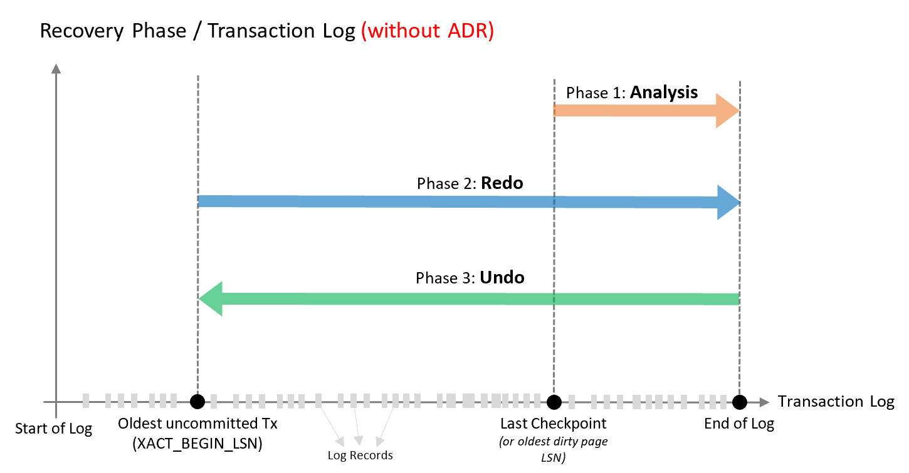
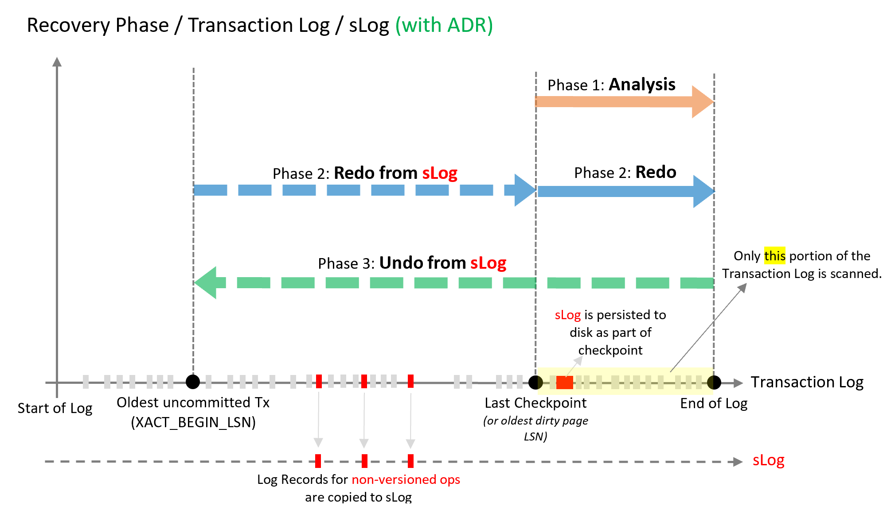

# Workshop: SQL Server 2019 Lab CTP 3.1

#### <i>A Microsoft workshop from the SQL Server team</i>

 <h2>SQL Server 2019 Mission Critical Availability</h2>

SQL Server 2019 includes new capabilities to keep your database and application highly available:

- Online Index Enhancements
- Enhancements to Availability Groups
- Availability Groups on Kubernetes
- Accelerated Database Recovery

You can read more details about all of these enhancements at https://docs.microsoft.com/en-us/sql/sql-server/what-s-new-in-sql-server-ver15?view=sqlallproducts-allversions.

You'll cover the following topics in this Module:

<dl>

  <dt><a href="#3-0">3.0 Accelerated Database Recovery</a></dt>
   
</dl>

<h2><a name="3-0">3.0 Accelerated Database Recovery</a></h2>

In this module you will learn about a new capability in SQL Server 2019 to solve problems caused by long running transactions. This enhancement to SQL Server 2019 is called Accelerated Database Recovery.

Accelerated Database Recovery started years ago as a project within Microsoft called Constant Time Recovery (CTR). The idea was to enhance the database engine so that the time it took to recover a database was constant instead of based on the length of the oldest active transaction as recorded in the transaction log. You can read more about the project in this detailed paper at https://www.microsoft.com/en-us/research/publication/constant-time-recovery-in-azure-sql-database.

<b><a name="challenge">The Challenge</a></b>

Long running transactions can take the following forms:

- A transaction that does not make alot of mmodifications but is held open for a long period of time
- A transaction that makes alot of data modifications (think deleting all rows in a 1 billion row table)

Both of these scenarios can lead to the following problems:

- A **long** time to **recover** the database should it be taken offline or SQL Server shutdown while a long running transaction is active.
- **Transaction rollback** for queries with alot of modifications can take a **long time** holding locks.
- The **transaction log** may grow unexpectedly because it **cannot be truncated** due to an active transactions.

<b><a name="solution">The Solution</a></b>

Accelerated Database Recovery (ADR) attempts to solve these problems by using a concept called the **Persistent Version Store (PVS)**. This is not the same version store that is kept in tempdb for snapshot isolation. The PVS is stored in the user database inside the rows of a page or in an off-row store internal table. Because it is persistent (i.e. survives restarts) it can be used for recovery purposes.

Now the **redo** and **undo** phases of recovery can be significantly faster (hence the term accelerated) because versions can be used to determine the state of a transaction (vs having to logically undo uncommitted transactions).

These diagrams from the documentation show the recovery process with and without ADR.

**Recovery without ADR** (this is the default)

**Recovery with ADR** (a new option with ALTER DATABASE)

Both the documentation at https://docs.microsoft.com/en-us/azure/sql-database/sql-database-accelerated-database-recovery and the paper at https://www.microsoft.com/en-us/research/publication/constant-time-recovery-in-azure-sql-database have detailed explanations of how ADR works including the PVS and a concept called the SLog (for system transactions).

Because of this design, not only is recovery must faster and no longer affected by a long running transaction but ADR provides two other benefits:

- **rollback** is **instant**. Because versions are tracked rollback involves simply marking a transaction as aborted
- **Log truncation** is no longer dependent on an active transaction.

A few questions that often come up:

- **Will my database be larger with the PVS?**

It will be larger than without ADR. However, it may not grow extremely large due to concepts like logical revert and cleanup processes designed with ADR. Testing is the only way to know but the paper has some observations from the engineering team.

- **Will it affect performance?**

As with any feature performance impact will vary. However, extremely "write-heavy" applications may see some effect. Typically those applications don't use long running transactions so they may not benefit from ADR. The paper has testing observations using benchmarks derived from TPC.

Proceed to the Activity to learn an example of how Accelerated Database Recovery works in SQL Server 2019.

<b><a name="activityadr">Activity: Accelerated Database Recovery</a></b>

In this activity, you will see how Accelerated Database Recovery affects log truncation and the speed of rollback.

**NOTE**: *If at anytime during the Activities of this Module you need to "start over" you can go back to the first Activity in 3.0 and run through all the steps again.*

<b><a name="activitysteps">Activity Steps</a></b>

All scripts for this activity can be found in the **sql2019lab\03_Availability\adr** folder. The database will be created as part of this activity. There is no need to restore a separate database.

**STEP 1: Use a T-SQL notebook to complete the rest of the activity.**

T-SQL notebooks provide a very nice method to execute T-SQL code with documentation in the form of markdown code. All the steps and documentation to complete the rest of the activity for Module 3.0 can be found in the T-SQL notebook **adr.ipynb** which can be found in the **sql2019lab\03_Availability\adr** folder.

**NOTE**: *A T-SQL script **adr.sql** is also provided if you want to go through the same steps as the notebook but use a tool like SQL Server Management Studio*.

T-SQL notebooks can be executed with Azure Data Studio. If you are familiar with using Azure Data Studio and T-SQL notebooks open up the **adr.ipynb** notebook and go through all the steps. When you are done proceed to the **Activity Summary** section for the Activity below.

If you have never opened a T-SQL notebook with Azure Data Studio, use the following instructions:

Launch the Azure Data Studio application. Look for the icon similar to this one:

The first time you launch Azure Data Studio, you may see the following choices. For the purposes of this workshop, select No to not load the preview feature and use x to close out the 2nd choice to collect usage data.
    

You will now be presented with the following screen to enter in your connection details for SQL Server. Use connection details as provided by your instructor to connect to SQL Server or the connection you have setup yourself for your SQL Server instance.

Now click the **Connect** button to connect. An example of a connection looks similar to this graphic (your server, Auth type, and login may be different):

A successful connection looks similar to this (your server may be different):

Use the File menu to open up the **adr.ipynb** notebook and go through all the steps. There is additional documentation on how to use SQL notebooks at https://docs.microsoft.com/en-us/sql/azure-data-studio/sql-notebooks. 

When you are done proceed to the **Activity Summary** section for the Activity below.

<b><a name="activitysummary">Activity Summary</a></b>

In this activity you have learned Accelerated Database recovery can speed up transaction rollback significantly. You have also learned how transaction log truncation is no longer affected by long running transactions.

<b><a name="bonusactivity">Bonus Activity</a></b>

If you have time use the T-SQL notebook **adr_recovery.ipynb** or T-SQL script **adr_recovery.sql** to see how ADR affects the recovery process. This bonus activity can take some time as a large number of modifications are needed to see a bigger effect on recovery.

Armed with this knowledge, proceed to the next activity to learn how **data virtualization** makes SQL Server 2019 the new "data hub".

<b>For Further Study</b>

- [Accelerated Databased Recovery](https://docs.microsoft.com/en-us/azure/sql-database/sql-database-accelerated-database-recovery)

- [The Constant Time Recovery Paper](https://www.microsoft.com/en-us/research/publication/constant-time-recovery-in-azure-sql-database )

- [What is Azure Data Studio?](https://docs.microsoft.com/en-us/sql/azure-data-studio/what-is)

- [How to use Notebooks in Azure Data Studio](https://docs.microsoft.com/en-us/sql/azure-data-studio/sql-notebooks)

<b >Next Steps</b>

Next, Continue to <a href="04_DataVirtualization.md" target="_blank"><i>Data Virtualization</i></a>.
