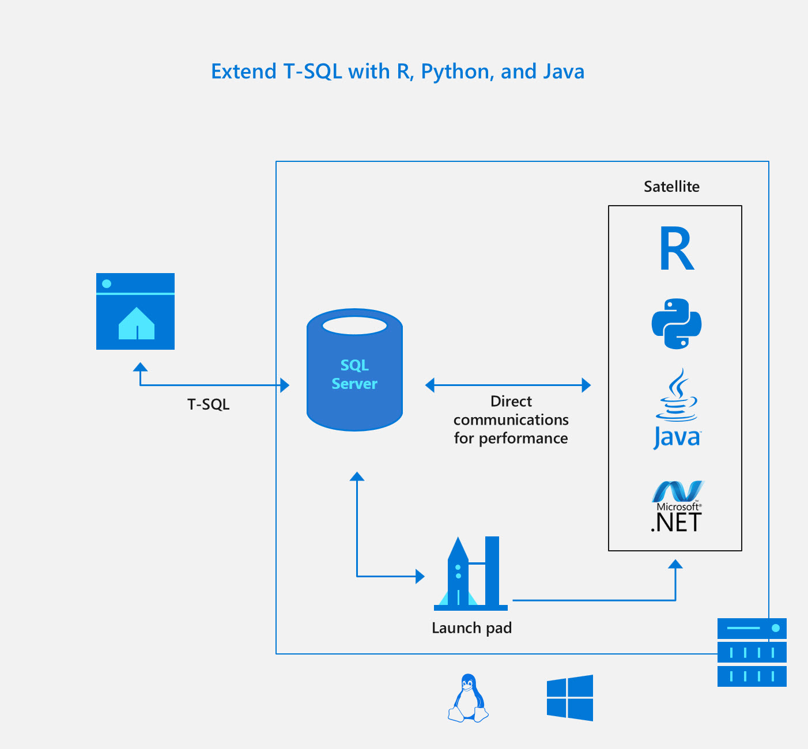
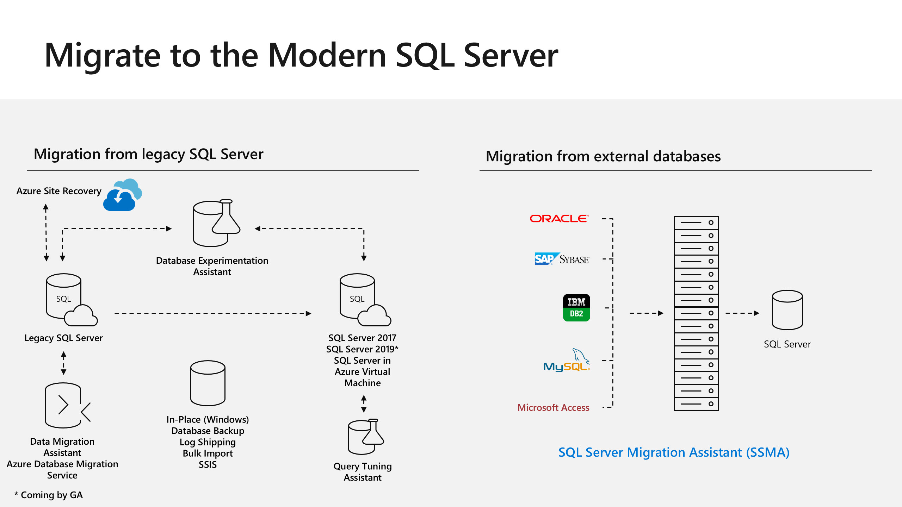

# Workshop: SQL Server 2019 Lab (RC)

#### <i>A Microsoft workshop from the SQL Server team</i>

<h2><b>     Additional Capabilities in SQL Server 2019 and Migration</b></h2>

This module is designed for you to read and learn about additional capabilities in SQL Server 2019, tools to assist Migration, using Database Compatibility, and Next Steps for your journey with SQL Server 2019. There are no activities for this module.

Use the slide deck in the [slides](https://github.com/microsoft/sqlworkshops/tree/master/sql2019lab/slides) folder as you read through this section for more details.

You will cover the following topics in this Module:

<dl>

<dt><a href="#6-0">6.0 Additional Capabilities in SQL Server 2019</a></dt>
<dt><a href="#6-1">6.1 Migration and Database Compatibility</a></dt>
   
</dl>

<h2><b><a name="6-0">     6.0 Additional Capabilities in SQL Server 2019</a></b></h2>

In this section of the module you will learn about additional capabilities in SQL Server 2019 including:

- SQL Server Language Extensions
- Features in the Database Engine based on the Voice of the Customer

<h3><b><a name="langext">SQL Server Language Extensions</a></b></h3>

To meet the challenge of extending the T-SQL language for requirements not met with T-SQL today we have built a framework called SQL Server Language Extensions. Using the same architecture as SQL Server Machine Learning Services, we now allow for new languages to be accessed via T-SQL as seen in the following diagram:

You can read more about SQL Server Language Extensions at https://docs.microsoft.com/en-us/sql/language-extensions/language-extensions-overview.

In SQL Server 2019, we have shipped Java as an example of using SQL Server Language Extensions. As part of the Java installation, we now include an open-source, full-supported version of Java from Azul. 

Try the Java tutorial to implement Regular Expressions at https://docs.microsoft.com/en-us/sql/language-extensions/tutorials/search-for-string-using-regular-expressions-in-java. 

<h3><b><a name="voicecustomer">The Voice of the Customer</a></b></h3>

All the capabilities you see in SQL Server 2019 are based on some type of feedback from our customers. While you have seen major capabilities in SQL Server 2019, there are other new features we have added to this release all based on the voice of the customer and customer feedback.

This list includes but is not limited to:

- Columnstore stats in DBCC CLONEDATABASE
- Estimate compression for Columnstore indexes
- Diagnostics for auto stats blocking
- The #1 voted customer feedback item of all time: String Truncation Error Message
- Troubleshoot page resource waits with new built-in T-SQL
- Custom capture policy for the Query Store
- MAXDOP and Memory Config during Setup
- Reduce recompiles for tempdb workloads
- Indirect Checkpoint Scalability

You can get more details about all of these in our documentation at https://docs.microsoft.com/en-us/sql/sql-server/what-s-new-in-sql-server-ver15.

<h2><b><a name="6-0">     6.1 Migration and Database Compatibility</a></b></h2>

As work towards a migration to SQL Server 2019, you need to consider a planned process for pre-migration, migration, and post-migration. We have provided a series of tools to help with this process.

In addition, database compatibility can become an important solution to make migrations easier and reduce the risk of upgrades.

Consider watching the following video called **Modernizing SQL Server** by Pam Lahoud and Pedro Lopes at https://www.youtube.com/watch?v=5RPkuQHcxxs to get the complete picture of migration and database compatibility.

<h3><b><a name="langext">Migration Tools</a></b></h3>

As you plan for a migration to SQL Server 2019, consider looking at the process to perform a pre-migration assessment, your options to migrate, and post-migration optimizations. The following diagram outlines tools we provide for these scenarios:

The following tools are available to help you in this process:

- **Data Migration Assistant (DMA)**

Download and use this free tool to assess the configuration of your SQL Server and database. You can read more about DMA at https://docs.microsoft.com/en-us/sql/dma/dma-overview.

- **Database Experimentation Assistant (DEA)**

Download and use this free tool to assess the performance of your queries using a replay/compare method. Read more about DEA at https://docs.microsoft.com/en-us/sql/dea/database-experimentation-assistant-overview.

- **Query Tuning Assistant (QTA)**

Use the power of Query Store along with the "knowledge base" of the SQL Engineering team to optimize queries after you migrate and want to look at moving to a newer database compatibility level. You can read more about QTA at https://docs.microsoft.com/en-us/sql/relational-databases/performance/upgrade-dbcompat-using-qta.

- **SQL Server Migration Assistant (SSMA)**

Migrate your schema and data from other database products into SQL Server using SQL Server Migration Assistant. You can read more about SSMA at https://docs.microsoft.com/en-us/sql/ssma/sql-server-migration-assistant.

In addition, if you need to lift and shift a SQL Server Virtual Machine directly to Azure take a look at the **Azure Site Recovery** Service at https://docs.microsoft.com/en-us/azure/site-recovery/migrate-tutorial-on-premises-azure.

<h3><b><a name="voicecustomer">Database Compatibility</a></b></h3>

Database Compatibility Levels can be a powerful solution to reduce the risk of upgrades to the latest releases of SQL Server. This includes protection of functionality and query plans. Microsoft is encouraging developers to use database compatibility as a method to *certify* an application vs a version of SQL Server.

Read all the details of using Database Compatibility Levels for upgrades at https://aka.ms/dbcompat.

<h2><b>     For Further Study</b></h2>

- [SQL Server Language Extensions](https://docs.microsoft.com/en-us/sql/dma/dma-overview)

- [What's New in SQL Server 2019](https://docs.microsoft.com/en-us/sql/sql-server/what-s-new-in-sql-server-ver15)

- [Data Migration Assistant](https://docs.microsoft.com/en-us/sql/dma/dma-overview)
 
- [Database Experimentation Assistant](https://docs.microsoft.com/en-us/sql/dea/database-experimentation-assistant-overview)

- [Query Tuning Assistant](https://docs.microsoft.com/en-us/sql/relational-databases/performance/upgrade-dbcompat-using-qta)

- [SQL Server Migration Assistant](https://docs.microsoft.com/en-us/sql/ssma/sql-server-migration-assistant)

- [Database Compatibility](https://aka.ms/dbcompat)

<h2><b>     Next Steps</b></h2>

Use the following resources to learn more on your journey to SQL Server 2019:

- Take advantage of all the free training at https://aka.ms/sqlworkshops
- Learn from videos and demos at https://aka.ms/sqlchannel
- Download and try SQL Server 2019 at http://aka.ms/ss19
- Watch the video of Modernizing SQL Server at https://www.youtube.com/watch?v=5RPkuQHcxxs to plan your migration
- Read the what’s new for SQL 2019 documentation at https://docs.microsoft.com/en-us/sql/sql-server/what-s-new-in-sql-server-ver15
- Sign-up for the EAP program at https://aka.ms/eapsignup

